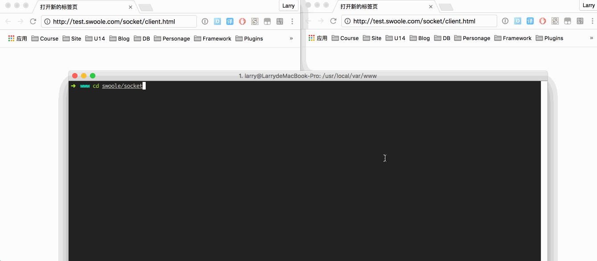

### 安装`Swoole`
1. mac安装swoole

		brew install homebrew/php/php56-swoole

2. 重启apache

		sudo brew services restart httpd24

### 下载
 	git clone git@github.com:larry-666/swoole-chat-room.git

### 使用
1. 运行`swoole websocket server`
```
cd www
cd swoole/socket
php server.php
```

3. 打开`http://localhost/swoole/socket/client.html`

### 演示


### 帮助
1. 使用守护进程
把`$server`的`daemonize`设置为`true`
